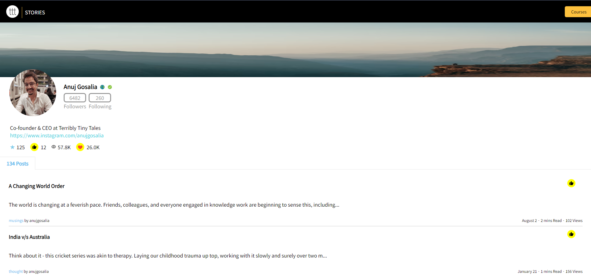

# PROFILE-PAGE USING REACT

Vercel Link - ttt-profile-page-reactjs.vercel.app

Welcome to the Terribly Tiny Tales assesment project on Profile Screen! This project provides a sleek and informative user profile screen for Terribly Tiny Tales CEO Mr. Anuj Gosalia, showcasing essential user information, posts, and highlights.

## Features

- **Profile Picture:** Display the user's profile picture prominently.
- **User Information:** Show user details such as name, location, and verified status.
- **Followers and Following Count:** Highlight the number of followers and accounts being followed.
- **Bio Section:** Provide a brief bio, along with a link to the user's Instagram profile.
- **Highlights Section:** Showcase notable achievements, including star ratings, upvotes, views, and likes.
- **Posts Section:** Present a collection of engaging posts with upvote functionality.

## Screenshots

## Tech Stack

- React
- React Icons

## Getting Started

    1. Clone the repository.
    2. Install dependencies with `npm install`.
    3. Run the app with `npm start`.

    
